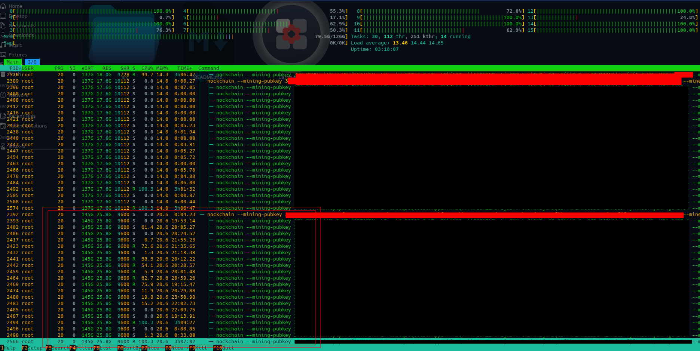

# Nockchain Mining Competition:

## Purpose:

This github repo serves to store my experiments and notes regarding the newly launched Nockchain.

All work is hosted on a linux VPS, running Ubuntu 24.04 LTS on Digital Ocean. Droplets range in size from 64-128GiB of RAM.  The information gathered here applies to this set up, and may not directly transfer to a set up on another OS or hardware stack.

## Server Setup (Ubuntu 24.04LTS on Digital Ocean):

- First, follow the [Nockchain Repo](https://github.com/zorp-corp/nockchain/tree/master) instructions to compile all code.
- A barebones VPS Droplet will run with many threads, and use about ~875Mb of RAM. Although small, it is prudent to remove superfluous processes and threads, to free up a little more memory and CPU capacity. The following commands are run to strip down the server:

```sh
#Sum total number of processes:
ps -e --no-headers | wc -l

#Sum total number of threads:
ps -eLf --no-headers | wc -l

#Check Services Running with this command:
systemctl list-units --type=service --state=running

#Disable ModemManager - we don't need it.
sudo systemctl disable --now ModemManager.service

#Remove superfluous packages and features:
sudo apt remove --purge snapd
sudo rm -rf ~/snap /snap /var/snap /var/lib/snapd

sudo apt remove --purge apport whoopsie popularity-contest friendly-recovery

#Common packages such as cups service and avahi-daemon are often installed. 
#If present, remove them.
sudo apt remove --purge cups cups-browsed cups-common cups-core-drivers cups-daemon cups-client
sudo apt remove --purge avahi-daemon bluez

```

Once completed, restart your server.  For my instance, I was able to get my number of processes/threads from (205/241) $\longrightarrow$ **(196/225)**, and my RAM usage from 876Mb $\longrightarrow$ **791Mb**.

### Basic Admin Scripts:

As per the Nockchain documentation, each node should have its own folder and local .env file.  Shell scripting should be used to bring up multiple nodes and take them down gracefully, In the ./scripts folder, I have generated some basic scripts to do so. They are listed below:


0) There currently is no setup script, as I am running a small number of nodes. An operator follows the nock install guide, makes a ./nodeX folder, and alters the .env settings. Then runs the scripts below.
1) **start_nodes.sh:** 
    - Starts up your array of nodes. 
    - Assumes node folders and .env files have been placed and configured. - - Checks to see that you activated `vm.overcommit_memory=1`.
    - starts a node process and redirects all console output to a node.log file in the ./nodeX directory.
2) **stop_nodes.sh:** 
    - find all PIDs associated and stop them. 
    - Wait X seconds
    - Clean up all the `nockchain_npc.sock` socket files.
3) **logs_tail.sh:** 
    - Apply the tail command to every node.log file in each node folder. - Gives a summary of the current state of the mining swarm via logs.

Please note, that these scripts need `chmod u+x` to make them executable, and it is assumed that your mining machine was already setup (as per the Nockchain install instructions, above).


### Basic Performance / Run Time Notes:

Using `bpytop` and `htop` the following was noted when running various node configurations. The minimum requirements for a Nockchain node were listed to be 64GB of RAM and about 6 processors. However, when actually running a node, the minimum resources suggested are not actually used. The following was observed.

- One node typically takes 2-3 vCPUs and uses about 19GiB of Ram.
- Adding more nodes linearly scales up the resources used. So N nodes uses approx N times 18GiB of Ram and N times (2-3)vCPUs.
- Node processes themselves spawn a lot of threads! For my setup, each process had 21 subthreads.
    - when in mining mode, threads cycle between the 2 or 3 vCPUs alloted.
    - when a connection to the backbone network expires, or a node is waiting for a block update, only one thread runs at 100%, the rest or idle.




### Log Messages:

Nockchain outputs RUST console logs for varoius components. Here are what some of them mean:

- ```SEvent: friendship ended with 12D3KooWCnQHkYZToT7o1f7hxKuVgiaYXs5cJugr3gujpViVRvs5 via: Dialer { address: /dnsaddr/nockchain-backbone.zorp.io, role_override: Dialer, port_use: Reuse }. cause: Some(KeepAliveTimeout)```. Not technically a problem, miner still runs. Sometimes it takes a while to connect to the backbone network - be patient.

- `thread 'serf' panicked at crates/nockvm/rust/nockvm/src/mem.rs:301:23: Box<dyn Any> note: run with RUST_BACKTRACE=1 environment variable to display a backtrace thread 'tokio-runtime-worker' panicked at crates/nockchain/src/mining.rs:175:14: Could not load mining kernel: OneshotChannelError(RecvError(())) W (16:36:32) mining: Error during mining attempt: JoinError::Panic(Id(108), "Could not load mining kernel: OneshotChannelError(RecvError(())), ...)`. Solution: Found [here](https://forum.nockchain.org/t/could-not-load-mining-kernel/526/13) . Linux kernel won't allow memory overcommit. You need to permit it. Run `sudo sysctl -w vm.overcommit_memory=1` in shell.


- `Error: Os { code: 98, kind: AddrInUse, message: "Address already in use" }`Solution: delete the socket file in your local .socket folder.


