## Code Strucure Diagrams:

Markdown's graph visualization (Mermaid was used.)
I manually went through every .hoon file and handcoded the relations.
The graph was then cleaned up and formatted - with and without subgroups,
using chatGPT+. 

There are a few minor mistakes in some of the graphs (not mission critical) - 
by both me and surprisingly, the chat robot (should be good at finding redundances)...
The perfect is the enemy of the good, and also coddles those without brains, 
so I just leave them in place.

Once the written graph was finalized, it was tweaked and displayed on 
[mermaid.live}(https://mermaid.live), and PNG files were saved from this.

PNGs were imported into Posterazor (Linux), so that the graphs could be printed 
for reference.

## Original Graph (done by hand:)

```mermaid
graph TD
    B[dumbnet/lib/types] --> A[dumbnet/inner.hoon]
    C[common/stark/prover] --> A
    D[common/tx-engine] --> A
    E[dumbnet/lib/miner] --> A
    F[dumbnet/lib/pending] --> A
    G[dumbnet/lib/derived] --> A
    H[dumbnet/lib/consensus] --> A
    I[common/pow] --> A
    J[common/nock-verifier] --> A
    K[common/zeke] --> A
    L[common/zoon] --> A
    M[common/wrapper] --> A
    A --> N[dumbnet/outer.hoon]
    I --> O[dumbnet/Ominer.hoon]
    C --> O
    K --> O
    L --> O
    M --> O
    B --> Q[dumbnet/lib/consensus.hoon]
    C --> Q
    I --> Q
    R[common/tx-engine] --> Q
    B --> S[dumbnet/lib/derived.hoon]
    R --> S
    L --> S
    B --> T[dumbnet/lib/Lminer.hoon]
    C --> T
    R --> T
    L --> T
    H --> U[dumbnet/lib/pending.hoon]
    B --> U
    R --> U
    L --> U
    L --> B
    K --> B
    V[common/wrapper] --> B
    R --> B
    C --> B
    O --> B
    W[common/bip39] --> X[dumbnet/wallet/wallet.hoon]
    Y[common/slip10] --> X
    Z[common/markdown/types] --> X
    AA[comomn/markdown/markdown] --> X
    R --> X
    K --> X
    L --> X
    B --> X
    AB[common/zose] --> X
    V --> X
    AD[common/table/prover/Icompute.hoon]--> C
    AE[common/table/prover/Imemory.hoon] --> C
    K --> C
    AF[common/nock-common.hoon] --> C
    AF --> AG[common/stark/verifier.hoon]
    K --> AG
    K --> AH[common/table/Ocompute.hoon] 
    K --> AI[common/table/Omemory.hoon]
    AH --> AD
    AJ[common/table/verifier/Icompute.hoon]  --> AD
    K--> AD
    AI--> AE
    AK[commmon/table/verifier/Imemory.hoon]--> AE
    K--> AE
    AL[constraint-util] --> AE
    AH--> AJ
    AM[mp-to-mega] --> AJ
    AL --> AJ
    K--> AJ
    AI--> AK
    K --> AK
    AM --> AK
    AN[common/ztd/eight.hoon]--> AO[common/ztd/eight.hoon]
    AP[common/bip39-english.hoon]  --> AQ[common/bip39.hoon]
    AB --> AQ
    AJ --> AF
    AK --> AF
    K --> AF
    K --> AS[common/nock-prover.hoon]
    C --> AS
    AF --> AS
    AG --> AT[common/nock-verifier.hoon]
    AF --> AT
    K --> AT
    K --> AU[common/pow.hoon]
    C --> AU
    AS --> AU
    K --> AV[common/slip10.hoon]
    AB --> AV
    AW[common/schedule.hoon] --> AX[common/tx-engine]
    AB --> AX
    K --> AX
    AN --> K
    K --> AY[common/zoon.hoon]
    K --> AB
    K --> AZ[dat/constraints.hoon]
    AF --> AZ
    K --> BA[dat/softed-constraints.hoon]
    K --> BB[dat/stark-config.hoon]
```

## Unstrucutured (non-subgroup code):

This was optimized by chatGPT+

```mermaid

%%{ init: { "flowchart": { "curve": "linear", "rankSpacing": 10, "nodeSpacing": 10 } } }%%
graph TD
    B[dumbnet/lib/types] --> A[dumbnet/inner.hoon]
    C[common/stark/prover] --> A
    D[common/tx-engine] --> A
    E[dumbnet/lib/miner] --> A
    F[dumbnet/lib/pending] --> A
    G[dumbnet/lib/derived] --> A
    H[dumbnet/lib/consensus] --> A
    I[common/pow] --> A
    J[common/nock-verifier] --> A
    K[common/zeke] --> A
    L[common/zoon] --> A
    M[common/wrapper] --> A
    A --> N[dumbnet/outer.hoon]
    I --> O[dumbnet/Ominer.hoon]
    C --> O
    K --> O
    L --> O
    M --> O
    B --> Q[dumbnet/lib/consensus.hoon]
    C --> Q
    I --> Q
    R[common/tx-engine] --> Q
    B --> S[dumbnet/lib/derived.hoon]
    R --> S
    L --> S
    B --> T[dumbnet/lib/Lminer.hoon]
    C --> T
    R --> T
    L --> T
    H --> U[dumbnet/lib/pending.hoon]
    B --> U
    R --> U
    L --> U
    L --> B
    K --> B
    V[common/wrapper] --> B
    R --> B
    C --> B
    O --> B
    W[common/bip39] --> X[dumbnet/wallet/wallet.hoon]
    Y[common/slip10] --> X
    Z[common/markdown/types] --> X
    AA[comomn/markdown/markdown] --> X
    R --> X
    K --> X
    L --> X
    B --> X
    AB[common/zose] --> X
    V --> X
    AD[common/table/prover/Icompute.hoon]--> C
    AE[common/table/prover/Imemory.hoon] --> C
    K --> C
    AF[common/nock-common.hoon] --> C
    AF --> AG[common/stark/verifier.hoon]
    K --> AG
    K --> AH[common/table/Ocompute.hoon] 
    K --> AI[common/table/Omemory.hoon]
    AH --> AD
    AJ[common/table/verifier/Icompute.hoon]  --> AD
    K--> AD
    AI--> AE
    AK[commmon/table/verifier/Imemory.hoon]--> AE
    K--> AE
    AL[constraint-util] --> AE
    AH--> AJ
    AM[mp-to-mega] --> AJ
    AL --> AJ
    K--> AJ
    AI--> AK
    K --> AK
    AM --> AK
    AN[common/ztd/eight.hoon]--> AO[common/ztd/eight.hoon]
    AP[common/bip39-english.hoon]  --> AQ[common/bip39.hoon]
    AB --> AQ
    AJ --> AF
    AK --> AF
    K --> AF
    K --> AS[common/nock-prover.hoon]
    C --> AS
    AF --> AS
    AG --> AT[common/nock-verifier.hoon]
    AF --> AT
    K --> AT
    K --> AU[common/pow.hoon]
    C --> AU
    AS --> AU
    K --> AV[common/slip10.hoon]
    AB --> AV
    AW[common/schedule.hoon] --> AX[common/tx-engine]
    AB --> AX
    K --> AX
    AN --> K
    K --> AY[common/zoon.hoon]
    K --> AB
    K --> AZ[dat/constraints.hoon]
    AF --> AZ
    K --> BA[dat/softed-constraints.hoon]
    K --> BB[dat/stark-config.hoon]

    classDef enhancedStyle background-color:#FFFFFF,color:#000000,fill:#f2f2f2,stroke:#333,stroke-width:8px,font-weight:bold,font-size:32px;
    class A,AA,AB,AC,AD,AE,AF,AG,AH,AI,AJ,AK,AL,AM,AN,AO,AP,AQ,AR,AS,AT,AU,AV,AW,AX,AY,AZ,B,BA,BB,C,D,E,F,G,H,I,J,K,L,M,N,O,P,Q,R,S,T,U,V,W,X,Y,Z enhancedStyle
    linkStyle default stroke-width:8px;
```

## Structured Graph (with folder sub-groupings):

Also optimized by chatGPT+.

```mermaid
graph TD
    subgraph dumbnet
        A[dumbnet/inner.hoon]
        B[dumbnet/lib/types]
        E[dumbnet/lib/miner]
        F[dumbnet/lib/pending]
        G[dumbnet/lib/derived]
        H[dumbnet/lib/consensus]
        N[dumbnet/outer.hoon]
        O[dumbnet/Ominer.hoon]
        Q[dumbnet/lib/consensus.hoon]
        S[dumbnet/lib/derived.hoon]
        T[dumbnet/lib/Lminer.hoon]
        U[dumbnet/lib/pending.hoon]
        X[dumbnet/wallet/wallet.hoon]
    end
    subgraph common
        AB[common/zose]
        AD[common/table/prover/Icompute.hoon]
        AE[common/table/prover/Imemory.hoon]
        AF[common/nock-common.hoon]
        AG[common/stark/verifier.hoon]
        AH[common/table/Ocompute.hoon]
        AI[common/table/Omemory.hoon]
        AJ[common/table/verifier/Icompute.hoon]
        AN[common/ztd/eight.hoon]
        AO[common/ztd/eight.hoon]
        AP[common/bip39-english.hoon]
        AQ[common/bip39.hoon]
        AS[common/nock-prover.hoon]
        AT[common/nock-verifier.hoon]
        AU[common/pow.hoon]
        AV[common/slip10.hoon]
        AW[common/schedule.hoon]
        AX[common/tx-engine]
        AY[common/zoon.hoon]
        C[common/stark/prover]
        D[common/tx-engine]
        I[common/pow]
        J[common/nock-verifier]
        K[common/zeke]
        L[common/zoon]
        M[common/wrapper]
        R[common/tx-engine]
        V[common/wrapper]
        W[common/bip39]
        Y[common/slip10]
        Z[common/markdown/types]
        AA[comomn/markdown/markdown]
        AL[constraint-util]
        AM[mp-to-mega]
    end
    subgraph wallet
        X[dumbnet/wallet/wallet.hoon]
    end
    subgraph dat
        AZ[dat/constraints.hoon]
        BA[dat/softed-constraints.hoon]
        BB[dat/stark-config.hoon]
    end

    B --> A
    C --> A
    D --> A
    E --> A
    F --> A
    G --> A
    H --> A
    I --> A
    J --> A
    K --> A
    L --> A
    M --> A
    A --> N
    I --> O
    C --> O
    K --> O
    L --> O
    M --> O
    B --> Q
    C --> Q
    I --> Q
    R --> Q
    B --> S
    R --> S
    L --> S
    B --> T
    C --> T
    R --> T
    L --> T
    H --> U
    B --> U
    R --> U
    L --> U
    L --> B
    K --> B
    V --> B
    R --> B
    C --> B
    O --> B
    W --> X
    Y --> X
    Z --> X
    AA --> X
    R --> X
    K --> X
    L --> X
    B --> X
    AB --> X
    V --> X
    AD --> C
    AE --> C
    K --> C
    AF --> C
    AF --> AG
    K --> AG
    K --> AH
    K --> AI
    AH --> AD
    AJ --> AD
    K --> AD
    AI --> AE
    AK --> AE
    K --> AE
    AL --> AE
    AH --> AJ
    AM --> AJ
    AL --> AJ
    K --> AJ
    AI --> AK
    K --> AK
    AM --> AK
    AN --> AO
    AP --> AQ
    AB --> AQ
    AJ --> AF
    AK --> AF
    K --> AF
    K --> AS
    C --> AS
    AF --> AS
    AG --> AT
    AF --> AT
    K --> AT
    K --> AU
    C --> AU
    AS --> AU
    K --> AV
    AB --> AV
    AW --> AX
    AB --> AX
    K --> AX
    AN --> K
    K --> AY
    K --> AB
    K --> AZ
    AF --> AZ
    K --> BA
    K --> BB

    classDef enhancedStyle background-color:#FFFFFF,color:#000000,fill:#f2f2f2,stroke:#333,stroke-width:8px,font-weight:bold,font-size:32px;
    class A,AA,AB,AD,AE,AF,AG,AH,AI,AJ,AK,AL,AM,AN,AO,AP,AQ,AS,AT,AU,AV,AW,AX,AY,AZ,B,BA,BB,C,D,E,F,G,H,I,J,K,L,M,N,O,Q,R,S,T,U,V,W,X,Y,Z enhancedStyle
    linkStyle default stroke-width:8px;

```

